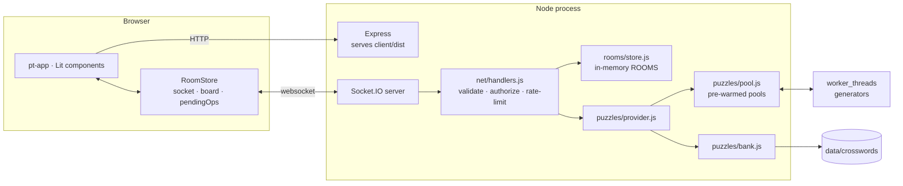
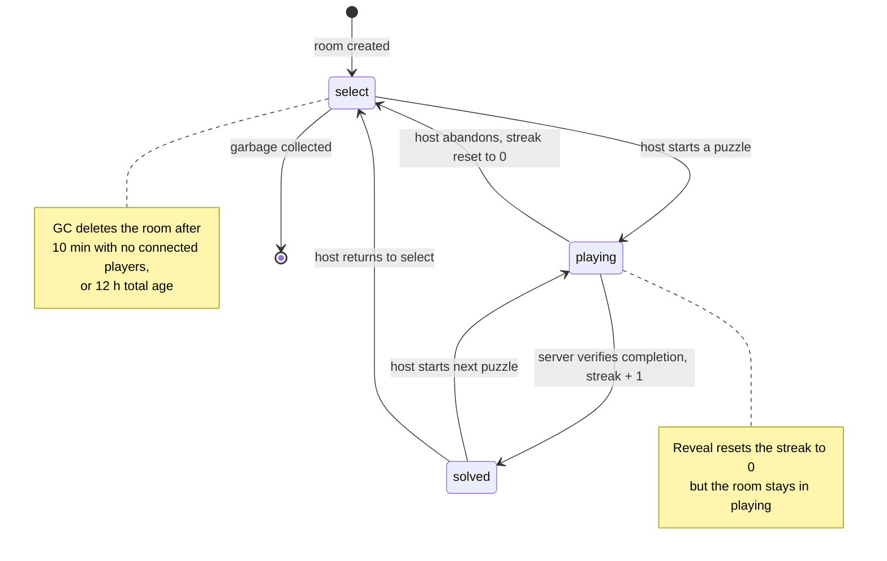
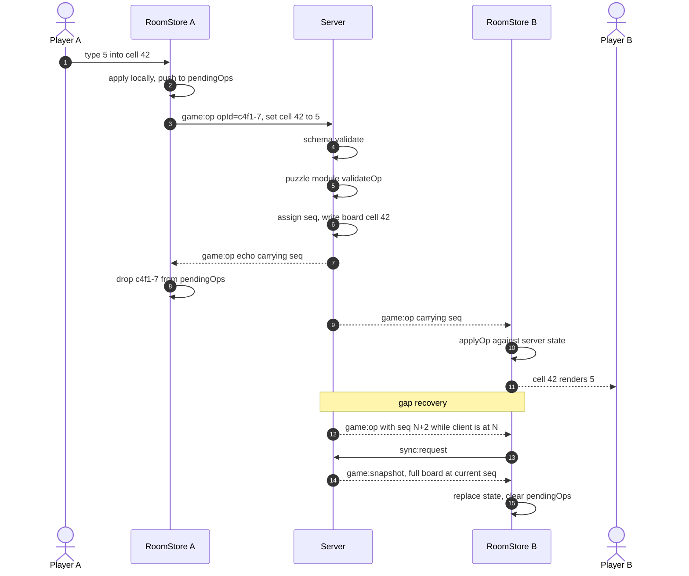
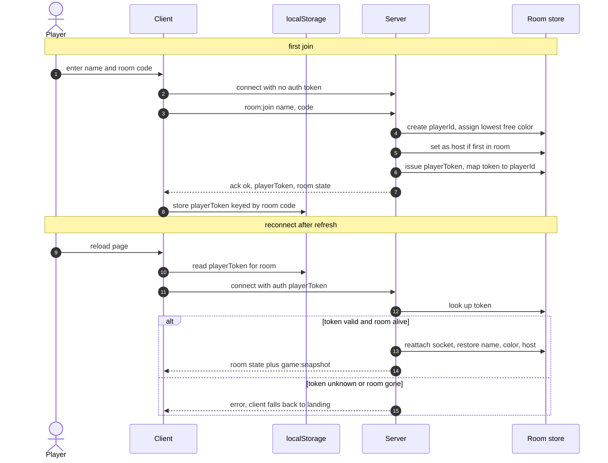
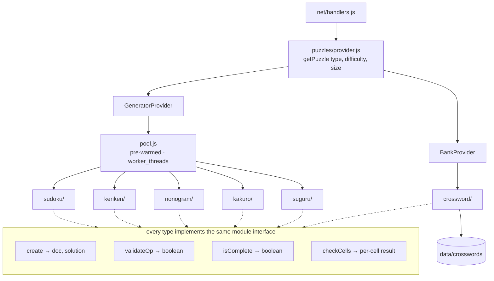
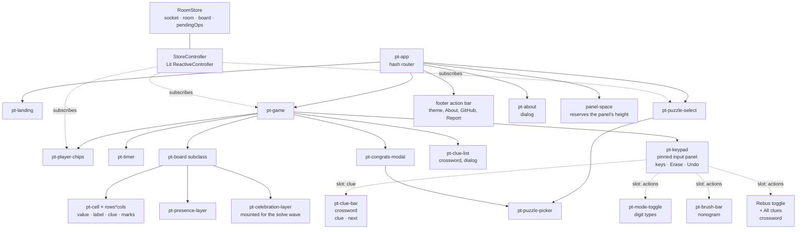

# PuzzleTogether: Architecture

> Companion to [design-spec.md](design-spec.md). Rationale lives in [adr/](adr/).
>
> Diagrams are Mermaid so GitHub renders them and they stay diffable. Update them in the same commit as the code they describe.

## 1. System context

One Node process. Express serves the built client in production; in development Vite serves it on 5173 and proxies `/socket.io` to Express on 3001. All gameplay traffic is Socket.IO; there is no gameplay REST API.

Room state lives in process memory and dies with the process ([ADR-0002](adr/0002-in-memory-rooms-no-database.md)). The only durable data on disk is the crossword bank.

Worker threads keep puzzle creation off the event loop. Sudoku generates fast enough inline, but kenken's uniqueness verification does not and kakuro's clue search does not, and a host pressing "new puzzle" expects an instant result, so all four generated types go through the same pre-warmed pool.

The pool is more than a cache: it is also where a puzzle is held to the difficulty that was asked for. Three of the four generators measure the difficulty of what they made rather than dialling it in, so the pool redraws with a fresh seed until the rating matches, up to a fixed budget ([ADR-0017](adr/0017-the-pool-redraws-for-difficulty.md)). That is the second reason this work cannot sit on the event loop: a take is now up to ten generations rather than one.

---

## 2. Room state machine

A room is always in exactly one of three states. The streak is a property of the room and mutates only on the marked transitions.

Every transition out of `select` and every button-initiated transition is host-only, authorized server-side against `playerId === room.hostId`. The client's `isHost` decides only whether the button renders.

`solved` is a real state rather than a modal flag because late joiners and reconnecting players need to land on the finished grid.

---

## 3. Op lifecycle

Clients apply their own edits immediately and reconcile against the server echo. The server is the only thing that assigns `seq` and the only thing that decides who won a conflict ([ADR-0001](adr/0001-shared-state-lww-per-cell.md)).

**Rendered state is `serverState + pendingOps`.** There is no rollback machinery. A remote op landing on a cell with a pending local op is resolved by re-deriving the view, which is cheap on a few hundred cells.

**Gap recovery is a full snapshot, not a replay.** The server keeps no op history. A client that misses ops asks for the whole board, a few KB. That trades bandwidth in a rare case for the removal of an entire class of bugs.

`shared/board-reducer.js` holds `applyOp()` and is imported by both sides, so client and server cannot drift in how an op is interpreted. The load-bearing test is the equivalence: applying ops sequentially yields the same state as the snapshot.

---

## 4. Join and reconnect

Identity is a server-issued opaque token, not a display name ([ADR-0005](adr/0005-reconnect-tokens-for-identity.md)). That is what makes a refresh mid-solve a non-event.

A disconnected player is not removed immediately. Their chip dims for a ~2 minute grace period, during which the token still reclaims their identity. Host status survives the grace period; only after it expires does the longest-connected player get promoted.

**Being removed is leaving, decided by somebody else.** `room:kick` is host-only; the target is told over their own socket before the seat is dropped, and their reconnect token dies with it. The client treats that message the way it treats leaving, keeping only the reason, so there is one path out of a room and one shape of state after it.

**Leaving is immediate, and the route is what triggers it.** `room:leave` gives up the seat now rather than on grace expiry, and the client sends it whenever the hash stops naming the room; the `Leave Room` button only navigates. That keeps the button, the wordmark, and the back button on one path. A reload is not that path: it fires no `hashchange`, so the reconnect token still does its job.

---

## 5. Puzzle module boundary

`getPuzzle()` is the only thing the rest of the server calls. Whether a puzzle was generated in a worker or read off disk is invisible past that line ([ADR-0004](adr/0004-hybrid-puzzle-supply.md)).

**Adding a generated type is two files and eight lines**: one server module implementing the four methods, one Lit subclass of `<pt-board>`, and one entry each in `PUZZLE_TYPES`, `PUZZLE_TYPE_NAMES`, `SIZES_BY_TYPE`, `DIFFICULTY_MIN_SIDE`, `provider.js` twice, `pool.js`, `generator-worker.js`, and the client's `registry.js`. A banked type writes three methods; it has no `create`.

Kakuro was the fifth type and it cost one line more than that: a kakuro prints its clues on the squares nobody writes in, and `DocCell` had no way to carry two sums and a diagonal, so it gained an optional `clue` ([ADR-0014](adr/0014-a-clue-cell-carries-two-sums.md)). **A type needing something from `shared/` is not automatically the abstraction failing**, which is how this was worded before; it is the schema being asked to describe a square it had not met. What would be the abstraction failing is a type needing a new *hook*, and kakuro needed none.

Suguru was the sixth type and, by this same measure, the abstraction held too: no new hook, and `shared/` did not change at all, since a cell's own alphabet bound is derived from `meta.regions` and cached rather than carried on `DocCell` ([ADR-0019](adr/0019-a-region-bounds-its-own-alphabet.md)). What suguru actually cost lived entirely inside its own generator, not at this boundary: its region and adjacency rules interact in a way none of the other four types' generators had to plan for, and getting a partition that is reliably fillable turned out to need its own decision, not a hook ([ADR-0021](adr/0021-a-region-needs-slack-not-just-room.md)).

`doc` is client-safe and `solution` never is. The provider returns both; the room holds both; only `doc` is serialized onto a socket. Check and Reveal are server RPCs so the solution stays put.

---

## 6. Client structure

**One store, one socket.** No component opens a connection; components subscribe through `StoreController` to the slices they need.

**Presence traffic never touches cell DOM.** Focus updates arrive at ~10/s per player. `<pt-presence-layer>` is an absolutely-positioned overlay that draws the stripes itself. `<pt-celebration-layer>` is the same argument for the solve wave: it is mounted for the length of the wave and removed, so mounting is the trigger.

**Cells render once.** `repeat()` keyed by cell index creates each `<pt-cell>` a single time; updates set reactive properties on the specific element that changed. This is the main frontend performance constraint, measured on a 25×25 grid in Phase 1.

**Shared leaves hold no state.** `<pt-mode-toggle>`, `<pt-brush-bar>`, and `<pt-puzzle-picker>` are told what is on and report the press, so the Notes toggle and the store can never disagree. They share appearance and semantics through the `actionButton` fragment in `client/styles/controls.js`. That file and `client/ui/icons.js` are the styling counterpart to the component tree: `css` fragments composed into each shadow root, since a shadow root inherits properties but not rules.

**The game screen does not know what a puzzle type is.** `client/boards/registry.js` maps a `doc.type` to its board element and to the kind of input it takes: `digits`, `brushes`, or `letters`. `<pt-game>` branches on the input kind and never on the type name. Sudoku, kenken, and kakuro share `digits` while having nothing else in common; there are fewer ways to put something in a cell than there are puzzles. The keypad reads the puzzle's own alphabet rather than its size, which is what lets a 9×9 kakuro offer nine digits where a 9×9 sudoku's would also be nine but a 7×7 kakuro's is still nine and a 7×7 kenken's is seven.

**The panel is one element with slots, not four screens.** `<pt-keypad>` is pinned to the foot of the viewport for every type and holds the keys; what changes between types is slotted in from `<pt-game>`: the clue strip, and the one setting that decides what a key means ([ADR-0010](adr/0010-one-pinned-input-panel.md)). The panel never has to ask which puzzle it is serving.

**The panel is fixed, so the page reserves its height in `pt-app`, not `pt-game`.** The page ends with the footer, not the game screen. The panel measures itself and announces the height; the app shell keeps a spacer that tall after the footer.

**A store slice that nothing selects does not exist.** `StoreController` re-renders only when its host's selected slices change, so state added for a new feature must be added to the selector too. Miss it and the screen lags one interaction behind.

---

## 7. What would change for multiple instances

Not being built; recorded so the constraint is visible ([ADR-0002](adr/0002-in-memory-rooms-no-database.md)):

- `@socket.io/redis-adapter` so broadcasts reach sockets on other instances.
- `ROOMS` moves into Redis, which makes every room mutation async and forces a concurrency story for `seq` assignment. Currently free, since a single process serializes it.
- Sticky sessions, or full room state in Redis so any instance can serve any socket.
- The puzzle pool becomes per-instance waste, or moves behind a shared queue.

The single-process design is a deliberate trade: it makes `seq` assignment, LWW resolution, and room GC trivially correct. Distributing it is a real project, not a config change.

---

## 8. Design decisions

| Decision | Original design | Why it changed | When |
|---|---|---|---|
| Registry input kinds are `digits`, `brushes`, `letters` | A fourth kind, `native`, meaning the platform's keyboard for crossword | The platform keyboard was dismissed by half a solver's ordinary actions and nothing could be pinned above it reliably ([ADR-0010](adr/0010-one-pinned-input-panel.md)) | Phase 4b, 2026-08-06 |
| `<pt-board>` reads keys on `.grid`; no `renderOverlay`, `focusTarget`, or `describeCell` | Keys read on the host, plus three hooks added to serve crossword's hidden input | The pressure on the base element came from borrowing platform input, not from a new type. Removing the input removed the cost | Phase 4b, 2026-08-06 |
| The panel's height is reserved in `pt-app`, after the footer | Reserved inside `pt-game` | The panel covers the whole page; a spacer in the game screen left the footer's theme control unclickable at any scroll position | Phase 4b, 2026-08-06 |
| Settings are `aria-pressed` icon buttons sharing `iconButton` | `<pt-switch>`, a `role="switch"` control with a sliding knob | Two accessibility patterns for one idea sat in the same bar; the switch needed a 2.5rem track the panel could not spare ([ADR-0011](adr/0011-icons-in-the-panel-words-in-the-page.md)) | Phase 4b, 2026-08-09 |
| Presence is a segmented stripe on the cell's bottom edge, drawn by the overlay | Up to three coloured dots in the cell's top-right with a `+n` | Dots were drawn in the content area at a size that grew with the room: they covered pencil marks and ran out of room at four players | Phase 4b, 2026-08-07 |
