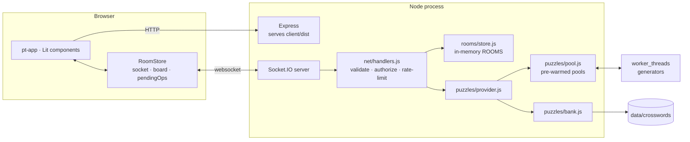
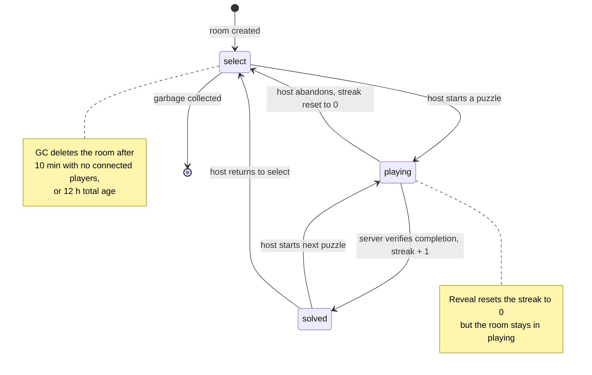
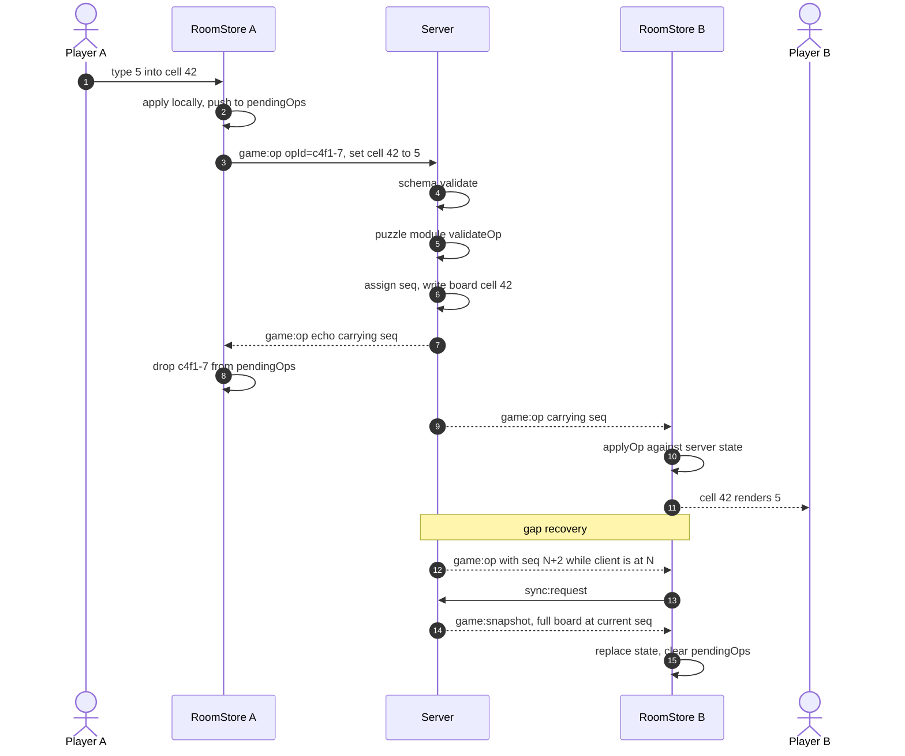
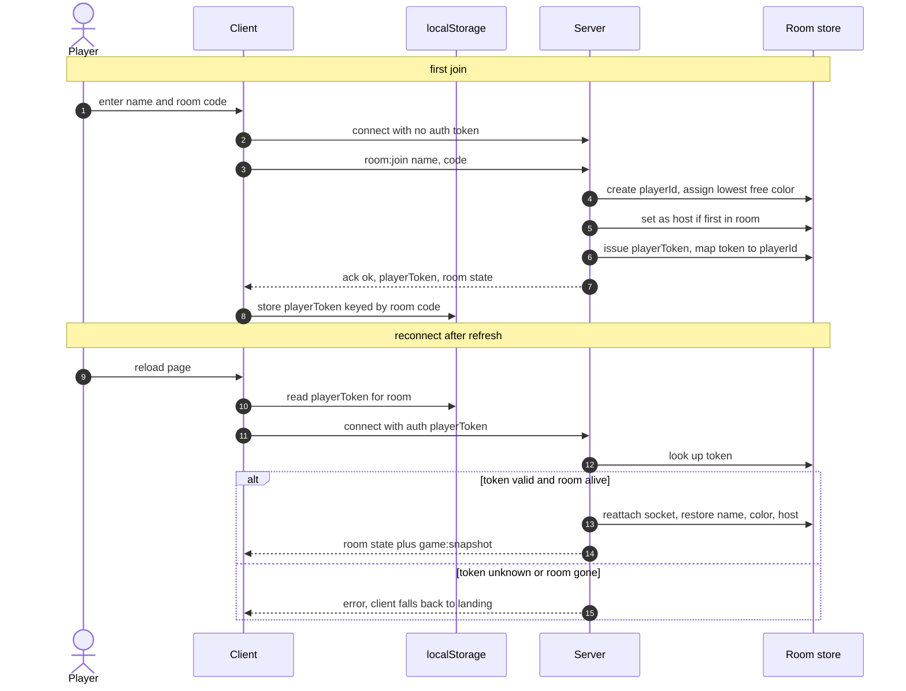
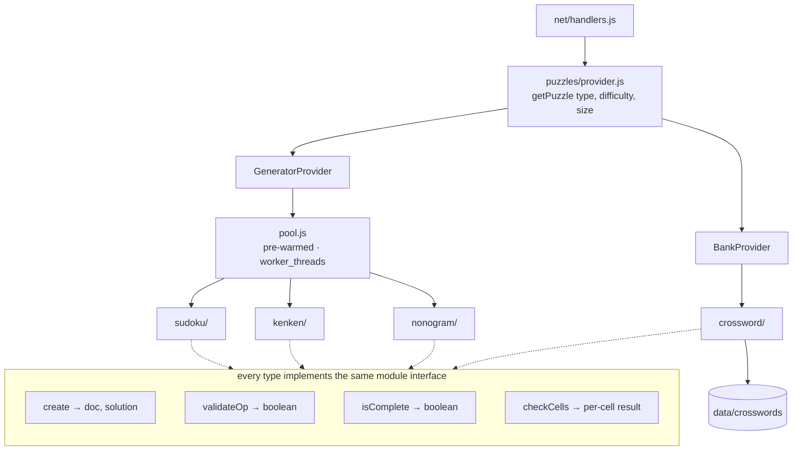
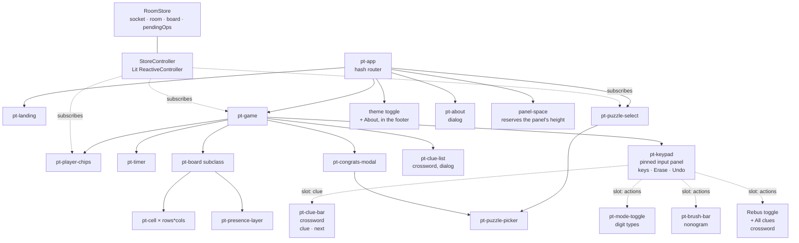

# PuzzleTogether — Architecture

> Companion to [design-spec.md](design-spec.md). Decisions and their rationale live in [adr/](adr/).
>
> Diagrams are Mermaid so they render on GitHub and stay diffable. Update them in the same commit as the code they describe.

## 1. System context

One Node process. Express serves the built client in production; in development Vite serves it on 5173 and proxies `/socket.io` through to Express on 3001. All gameplay traffic is Socket.IO — there is no gameplay REST API.

Room state lives in process memory and dies with the process ([ADR-0002](adr/0002-in-memory-rooms-no-database.md)). The only durable data on disk is the crossword bank.

The generator worker threads are what keep puzzle creation off the event loop. Sudoku is fast enough to generate inline, but kenken uniqueness verification is not, and the host pressing "new puzzle" from the congrats modal expects an instant result — so all three generated types go through the same pre-warmed pool.

---

## 2. Room state machine

A room is always in exactly one of three states. The streak is a property of the room and mutates only on the transitions marked below.

Every transition out of `select` and every transition initiated by a button is **host-only**, authorized server-side against `playerId === room.hostId`. The client's `isHost` decides only whether the button renders.

`solved` is a real state rather than a modal flag because late joiners and reconnecting players need to land on the finished grid, not an empty one.

---

## 3. Op lifecycle

The core loop. Clients apply their own edits immediately and reconcile against the server echo; the server is the only thing that assigns `seq`, and the only thing that decides who won a conflict ([ADR-0001](adr/0001-shared-state-lww-per-cell.md)).

Two things worth stating plainly because they shape everything else:

**Rendered state is `serverState + pendingOps`.** There is no rollback machinery. When a remote op lands on a cell that has a pending local op, re-deriving the view resolves it, and re-deriving is cheap on a grid of a few hundred cells.

**Gap recovery is a full snapshot, not a replay.** The server keeps no op history to replay from. A client that misses ops asks for the whole board, which is a few KB. This trades a little bandwidth in a rare case for the removal of an entire class of bugs.

`shared/board-reducer.js` holds `applyOp()` and is imported by *both* sides, so client and server cannot drift in how an op is interpreted. The test that matters most asserts the equivalence: applying ops sequentially yields the same state as the snapshot.

---

## 4. Join and reconnect

Identity is a server-issued opaque token, not a display name ([ADR-0005](adr/0005-reconnect-tokens-for-identity.md)). This is what makes a refresh mid-solve a non-event.

A disconnected player is **not** removed immediately. Their chip dims for a ~2 minute grace period, during which the token still reclaims their identity. Host status survives the grace period too; only after it expires does the longest-connected player get promoted.

This is the direct fix for the prototype's empty `disconnect` handler, which leaked players into rooms permanently.

**Being removed is leaving, decided by somebody else.** `room:kick` is host-only; the target is told over their own socket before the seat is dropped, and their reconnect token dies with it. The client treats that message the way it treats leaving — the room is cleared, only the reason is kept — so there is one path out of a room and one shape of state after it.

**Leaving is immediate, and the route is what triggers it.** `room:leave` gives up the seat now rather than on grace expiry, and the client sends it whenever the hash stops naming the room — the `Leave room` button only navigates. That keeps the button, the wordmark, and the browser's back button on one path, so none of them can leave a player listed in a room they have walked away from. A reload is not that path: it fires no `hashchange`, so the reconnect token still does its job.

---

## 5. Puzzle module boundary

The seam that makes a fifth puzzle type cheap. `getPuzzle()` is the only thing the rest of the server calls; whether a puzzle was generated in a worker or read off disk is invisible past that line ([ADR-0004](adr/0004-hybrid-puzzle-supply.md)).

**Adding a fifth type is exactly two files**: one server module implementing the four methods above, and one Lit subclass of `<pt-board>`. If it ever requires touching `shared/` or `<pt-board>` itself, the abstraction is wrong — which is why Phase 3 treats "no shared-code changes were needed" as its done-when criterion rather than a nice-to-have.

`doc` is client-safe and `solution` never is. The provider returns both; the room holds both; only `doc` is ever serialized onto a socket. Check and Reveal are server RPCs precisely so the solution stays put.

---

## 6. Client structure

**One store, one socket.** No component opens a connection; components subscribe through `StoreController` to the slices they need.

**Presence traffic never touches cell DOM.** Focus updates arrive at ~10/s per player, and routing them through `<pt-cell>` would re-render the grid constantly. `<pt-presence-layer>` is an absolutely-positioned overlay that draws the dots itself.

**Cells render once.** `repeat()` keyed by cell index creates each `<pt-cell>` a single time; subsequent updates set reactive properties on the specific element that changed. This is the main frontend performance unknown, which is why a 25×25 grid gets tested in Phase 1 rather than when nonogram actually ships in Phase 3.

**Shared leaves hold no state.** `<pt-mode-toggle>`, `<pt-brush-bar>`, and `<pt-puzzle-picker>` are told what is on and report the press, which is why the Notes toggle and the store can never disagree about the input mode. Since [ADR-0011](adr/0011-icons-in-the-panel-words-in-the-page.md) the settings share no *element* — there is no `<pt-switch>` any more — but they share their whole appearance and semantics through the `iconButton` fragment in `client/styles/controls.js`. That file and `client/ui/icons.js` are the styling counterpart to the component tree: `css` fragments and templates composed into each shadow root, since a shadow root inherits properties but not rules.

**The game screen does not know what a puzzle type is.** `client/boards/registry.js` maps a `doc.type` to the board element that renders it and to the *kind of input* it takes — `digits`, `brushes`, or `letters`. `<pt-game>` branches on the input kind and never on the type name, which is what keeps a new type from adding a conditional to a screen that has nothing to do with it. Sudoku and kenken share `digits` while having nothing else in common; there are far fewer ways to put something in a cell than there are puzzles.

**The panel is one element with slots, not four screens.** `<pt-keypad>` is pinned to the foot of the viewport for every type and holds the keys; what changes between types is slotted in from `<pt-game>` — the clue strip, and the one setting that decides what a key means ([ADR-0010](adr/0010-one-pinned-input-panel.md)). That is what keeps the panel from ever having to ask which puzzle it is serving. There was briefly a fourth input kind, `native`, meaning "the platform's keyboard, not ours"; it is gone, and with it every branch that existed to render nothing.

**The panel is fixed, so the page reserves its height — in `pt-app`, not in `pt-game`.** A panel pinned to the viewport covers whatever the page ends with, and the page does not end with the game screen: it ends with the footer. The panel measures itself and announces the height; the app shell keeps a spacer that tall after the footer. Reserved inside the game screen instead, the theme switch sat underneath the keys and could not be clicked at any scroll position.

**A store slice that nothing selects does not exist.** `StoreController` re-renders only when its host's selected slices change, so state added for a new feature has to be added to the selector as well. The nonogram brush was not, and the whole screen lagged one interaction behind — the store held the new brush and nothing re-read it until some unrelated update came along. Cheap to fix, easy to repeat.

---

## 7. What would change for multiple instances

Not being built now, recorded so the constraint is visible ([ADR-0002](adr/0002-in-memory-rooms-no-database.md)):

- `@socket.io/redis-adapter` so broadcasts reach sockets on other instances.
- `ROOMS` moves out of process memory into Redis, which makes every room mutation async and forces a concurrency story for `seq` assignment — currently free, since a single process serializes it.
- Sticky sessions, or full room state in Redis so any instance can serve any socket.
- The puzzle pool becomes per-instance waste, or moves behind a shared queue.

The single-process design is a deliberate trade: it makes `seq` assignment, LWW resolution, and room GC trivially correct. Distributing it is a real project, not a config change.
